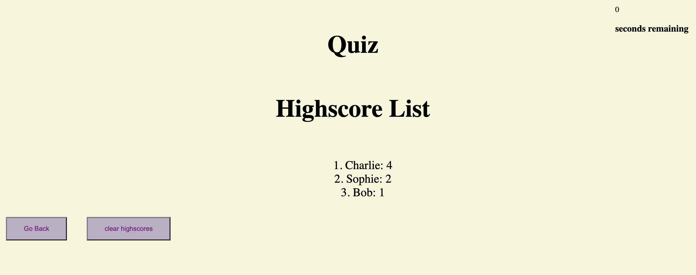

# 04-Web-APIs-Code-Quiz
Timed quiz using JavaScript that stores high scores 

 
 
# Quiz Features
The Quiz website includes a multitude of features including:
 * Start button to begin the quiz  
 * List of questions to answer  
 * If a question is answered incorrectly 10 seconds from the timer is subtracted  
 * The quiz ends once all the questions are answered or the timer count equals 0  
 * The quiz ends once all the questions are answered or the timer count equals 0  
 * The user inputs their name and the name and score are saved in local storage  
 * The highscore values are saved, but can be permananetly removed by clicking clear highscores button  
 
 # Finished Quiz Page
  
 
 # Highscore List
  

# Website Link

 Link to the deployed site:
 [Jasmine's Portfolio](https://jvn101.github./)

***
### Contact us
Contact our developer for any questions  
<JVN101@software.com>

